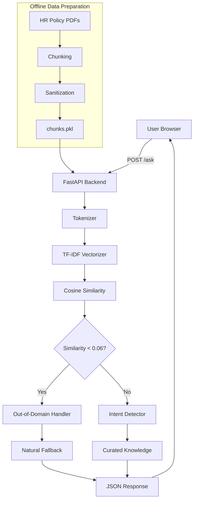

# PolicyPilot | Enterprise RAG HR Assistant

> An enterprise-style Retrieval-Augmented Generation (RAG) assistant that helps employees instantly understand company HR policies using natural-language queries.

**Live Demo:** https://policy-pilot-8vpo.onrender.com
**Status:** Production Live on Render (Free Tier)


---

## Table of Contents

* [Overview](#overview)
* [Problem Statement](#problem-statement)
* [Objectives](#objectives)
* [Key Features](#key-features)
* [Supported HR Domains](#supported-hr-domains)
* [Tech Stack](#tech-stack)
* [System Architecture](#system-architecture)
* [How the System Works](#how-the-system-works)
* [Project Structure](#project-structure)
* [Installation & Setup](#installation--setup)
* [Environment Variables](#environment-variables)
* [Usage](#usage)
* [API Documentation](#api-documentation)
* [Development Journey](#development-journey)
* [Challenges Faced & Solutions](#challenges-faced--solutions)
* [Debugging & Troubleshooting](#debugging--troubleshooting)
* [Testing](#testing)
* [Security Considerations](#security-considerations)
* [Performance & Optimization](#performance--optimization)
* [Database / Knowledge Store](#database--knowledge-store)
* [Deployment](#deployment)
* [Limitations](#limitations)
* [Future Improvements](#future-improvements)
* [What I Learned](#what-i-learned)
* [Project Outcome](#project-outcome)
* [Rejected Approaches](#rejected-approaches)
* [Contributors](#contributors)
* [License](#license)
* [Acknowledgements](#acknowledgements)

---

# Overview

**PolicyPilot** is a lightweight, enterprise-style RAG-based HR policy assistant designed to help employees quickly find information from company policy documents.

Instead of manually searching through lengthy HR PDFs or repeatedly asking HR teams basic questions, employees can interact with PolicyPilot using natural language.

For example:

* `What is the leave policy?`
* `How can I claim reimbursement?`
* `What are the working hours?`
* `What is the WFH policy?`
* `How does the performance review work?`
* `What is the notice period?`

The system processes the question, determines whether it belongs to the supported HR knowledge domain, identifies the relevant intent, and returns a clean, curated response.

The project was designed with three major goals:

1. **Accuracy** — Avoid irrelevant or hallucinated answers.
2. **Safety** — Prevent raw document content and unintended information from being exposed.
3. **Efficiency** — Build and deploy the application using minimal resources without relying on paid LLM APIs.

PolicyPilot was specifically designed as a portfolio project demonstrating an end-to-end RAG system, guardrails, lightweight information retrieval, API development, frontend engineering, debugging, and cloud deployment.

---

# Problem Statement

In a typical organization, HR policies are often distributed across multiple documents such as:

* Leave Policy
* Work From Home Policy
* Reimbursement Policy
* Working Hours Policy
* Performance Policy
* Notice Period Policy

Employees may need to search through lengthy PDFs or contact HR for simple questions.

This creates several problems:

### 1. Information is scattered

HR information can exist across multiple documents, making it difficult to locate specific information quickly.

### 2. Repetitive HR queries

Employees frequently ask HR teams questions that could be answered directly from existing policy documents.

### 3. Traditional AI can hallucinate

Generic AI assistants may generate plausible but incorrect policy information if they do not have access to the organization's actual documents.

### 4. Raw PDF retrieval is not necessarily production-safe

A naive RAG implementation may simply return the most similar PDF chunk.

That approach can unintentionally expose:

* Sample names
* Template information
* Years
* Model references
* Irrelevant document content

### 5. Deployment constraints

Using large machine-learning dependencies such as `scikit-learn` created significant deployment problems on Render's free tier.

PolicyPilot was therefore designed around a lightweight retrieval pipeline instead of relying on a large external ML stack.

---

# Objectives

The primary objectives of PolicyPilot were:

* Build a RAG-based HR assistant without paid LLM APIs.
* Implement local TF-IDF retrieval.
* Support six core HR domains.
* Provide clean and deterministic responses.
* Prevent raw document chunks from being displayed directly.
* Implement intent detection.
* Implement out-of-domain detection.
* Handle greetings and common conversational inputs.
* Detect basic prompt-injection/jailbreak attempts.
* Sanitize sensitive or unnecessary document information.
* Build a premium enterprise-style frontend.
* Keep deployment lightweight enough for Render's free tier.
* Minimize memory consumption and deployment time.

The six supported domains are:

1. Leave
2. Work From Home
3. Working Hours
4. Reimbursement
5. Performance
6. Notice Period

---

# Key Features

## 1. Intent-Based Answering

PolicyPilot does not simply return the most similar document chunk.

Instead, the system identifies what the user is actually asking and maps the question to one of the supported HR intents.

For example:

```text
User:
How can I claim reimbursement?

        ↓

Intent Detection

        ↓

Reimbursement

        ↓

Curated Reimbursement Answer
```

This prevents irrelevant retrieved chunks from directly determining the final response.

---

## 2. Custom TF-IDF Retrieval

The retrieval engine uses a custom implementation of TF-IDF built using lightweight Python components.

It includes:

* Unigram tokens
* Bigram tokens
* Term Frequency
* Inverse Document Frequency
* L2 normalization
* Cosine similarity

The implementation uses:

* `numpy`
* `re`
* Python collections

No `scikit-learn` dependency is required.

All 32 document chunk vectors are pre-computed during application startup.

---

## 3. Curated Knowledge Responses

One of the most important architectural decisions was separating **retrieval** from **answer generation**.

The system retrieves documents to determine whether the query is relevant.

However, the retrieved chunk itself is not returned to the user.

Instead:

```text
User Question
      ↓
TF-IDF Retrieval
      ↓
Similarity Check
      ↓
Intent Detection
      ↓
Curated Knowledge
      ↓
Final Answer
```

This prevents raw document content from being unnecessarily exposed.

---

## 4. Out-of-Domain Detection

If the highest similarity score is below the configured threshold, the system treats the query as outside the supported HR knowledge base.

For example:

```text
Who is Narendra Modi?
```

does not receive an HR policy answer.

Instead, the assistant responds with a natural explanation that it is focused on internal HR policies.

---

## 5. Prompt Injection Protection

The system checks for known jailbreak-style phrases such as:

```text
ignore previous instructions
system prompt
```

These queries are blocked rather than being processed as normal HR questions.

---

## 6. Natural Conversation Handling

The assistant handles common conversational inputs such as:

```text
Hi
Hello
```

with a friendly response instead of attempting to retrieve an HR policy.

The system also has explicit handling for company-name queries so that unsupported questions do not accidentally fall through to an unrelated HR intent.

---

## 7. Enterprise-Style Frontend

The frontend was designed to look more like a modern enterprise application than a basic chatbot.

Features include:

* Dark theme
* Glassmorphism
* Animated background elements
* Grid effects
* Sidebar
* Quick-action prompts
* Chat interface
* Typing indicator
* Message animations
* Responsive layout
* Empty-state UI

---

## 8. Lightweight Deployment

The final application requires only three main Python dependencies:

```text
fastapi
uvicorn
numpy
```

Removing `scikit-learn` dramatically reduced the deployment overhead.

The final deployment build takes approximately 30–45 seconds compared with the much longer build process experienced with the original dependency stack.

---

# Supported HR Domains

| Domain         | Example Query                         |
| -------------- | ------------------------------------- |
| Leave          | What is the leave policy?             |
| Work From Home | What is the WFH policy?               |
| Working Hours  | What are the working hours?           |
| Reimbursement  | How can I claim reimbursement?        |
| Performance    | How does the performance review work? |
| Notice Period  | What is the notice period?            |

Example supported responses include leave-policy information, reimbursement rules, working hours, and performance-related policy information.

---

# Tech Stack

| Layer               | Technology          | Purpose                 |
| ------------------- | ------------------- | ----------------------- |
| Backend             | Python 3.11         | Application logic       |
| API                 | FastAPI             | REST API                |
| Retrieval           | Custom TF-IDF       | Document similarity     |
| Numerical Computing | NumPy               | Vector operations       |
| Tokenization        | Python `re`         | Text preprocessing      |
| Frontend            | HTML/CSS/JavaScript | User interface          |
| Data Preparation    | PyMuPDF             | PDF extraction          |
| Knowledge Store     | Python Pickle       | Stores processed chunks |
| Deployment          | Render              | Cloud hosting           |
| Version Control     | Git + GitHub        | Source control          |

The project intentionally avoids:

* External LLM APIs
* Vector databases
* Traditional databases
* Large ML frameworks

This keeps the application simple and suitable for a small knowledge base.

---

# System Architecture



The architecture uses TF-IDF similarity as a relevance gate, while the intent detector and curated knowledge dictionary determine the final answer.

---

# How the System Works

## Step 1 — User Input

The user submits a natural-language question through the web interface.

Example:

```text
How can I claim reimbursement?
```

---

## Step 2 — Tokenization

The question is converted into tokens containing words and bigrams.

Example:

```text
How can I claim reimbursement?
```

becomes conceptually similar to:

```text
how
can
claim
reimbursement
how_can
can_claim
claim_reimbursement
```

---

## Step 3 — TF-IDF Vectorization

The query is converted into a numerical TF-IDF vector.

The same vocabulary and IDF values used for the document chunks are used for the query.

---

## Step 4 — Cosine Similarity

The query vector is compared against the pre-computed vectors of the 32 knowledge chunks.

Conceptually:

```text
similarity = query_vector · chunk_vectors
```

The highest similarity score becomes:

```text
max_sim
```

---

## Step 5 — Relevance Gate

The system checks:

```text
max_sim < 0.06
```

If true:

```text
Out-of-domain
```

If false, the query proceeds to intent detection.

---

## Step 6 — Intent Detection

The user's question is analyzed for intent-specific keywords.

For example:

```text
reimbursement
```

strongly increases the reimbursement score.

Similarly:

```text
leave
```

increases the leave score.

The important design decision is that **only the user's question is used for intent scoring**.

The retrieved chunk is not mixed into intent detection.

---

## Step 7 — Curated Answer

Once the intent is identified, the system retrieves the corresponding answer from the curated `KNOWLEDGE` dictionary.

The raw retrieved chunk is never directly returned.

---

## Step 8 — JSON Response

The API returns:

```json
{
  "answer": "### 🏠 Leave Policy\n..."
}
```

The frontend then renders the response.

---

# Data Preparation

The original HR policy PDFs are processed offline.

The preparation pipeline is:

```text
HR PDFs
   ↓
PyMuPDF
   ↓
Text Extraction
   ↓
Chunking
   ↓
Cleaning / Sanitization
   ↓
Pickle
   ↓
chunks.pkl
```

The project uses:

* 2 HR PDFs
* 32 text chunks
* Approximately 500-character chunks
* 100-character overlap

---

# Project Structure

```text
policy-pilot/
│
├── app.py
│   └── FastAPI backend
│   └── TF-IDF implementation
│   └── Intent detection
│   └── Guardrails
│   └── KNOWLEDGE dictionary
│
├── index.html
│   └── Complete frontend
│   └── HTML
│   └── CSS
│   └── JavaScript
│
├── chunks.pkl
│   └── Processed HR policy chunks
│
├── requirements.txt
│   └── Python dependencies
│
├── .gitignore
│
└── README.md
```

The project intentionally keeps the structure simple and does not require a frontend build system or backend package hierarchy.

---

# File Responsibilities

### `app.py`

The main backend application.

Responsible for:

* Loading `chunks.pkl`
* Building the vocabulary
* Calculating IDF
* Creating TF-IDF vectors
* Calculating cosine similarity
* Detecting intent
* Applying guardrails
* Returning API responses

---

### `index.html`

The complete frontend application.

Contains:

* HTML structure
* CSS
* JavaScript
* Sidebar
* Quick prompts
* Chat interface
* Input controls
* Animations

No frontend build step is required.

---

### `chunks.pkl`

Contains the processed HR policy chunks.

Structure:

```python
List[str]
```

The current knowledge base contains 32 strings.

---

### `requirements.txt`

Contains the intentionally minimal dependency list:

```text
fastapi==0.110.0
uvicorn==0.29.0
numpy==1.26.4
```

---

# Installation & Setup

## Prerequisites

Install:

* Python 3.11+
* Git

---

## 1. Clone the Repository

```bash
git clone https://github.com/YOUR_USERNAME/policy-pilot.git
cd policy-pilot
```

---

## 2. Create a Virtual Environment

### Windows

```bash
python -m venv venv
venv\Scripts\activate
```

### macOS / Linux

```bash
python3 -m venv venv
source venv/bin/activate
```

---

## 3. Install Dependencies

```bash
pip install -r requirements.txt
```

---

## 4. Verify `chunks.pkl`

Make sure the following file exists in the project root:

```text
chunks.pkl
```

Without this file, the backend cannot load the knowledge base.

---

## 5. Start the Application

```bash
uvicorn app:app --reload --port 8000
```

---

## 6. Open the Application

Visit:

```text
http://localhost:8000
```

---

# Environment Variables

The current version does not require environment variables.

This is intentional.

The application does not require:

* OpenAI API keys
* Database credentials
* Vector database credentials
* Cloud AI credentials

If an external LLM is introduced in a future version, environment variables can be added through a `.env.example` file.

Example:

```env
OPENAI_API_KEY=your_api_key_here
PORT=8000
```

---

# Usage

Once the application is running, try questions such as:

```text
What is the leave policy?
```

```text
How can I claim reimbursement?
```

```text
What are the working hours?
```

```text
What is the WFH policy?
```

```text
Explain the performance review process.
```

```text
What is the notice period?
```

The application also handles unsupported questions.

Example:

```text
Who is Narendra Modi?
```

The assistant recognizes that the question is outside the HR policy domain and provides a natural fallback instead of generating an unrelated answer.

---

# Example API Usage

## Base URL

Production:

```text
https://policy-pilot-8vpo.onrender.com
```

Local:

```text
http://localhost:8000
```

---

## `GET /`

Serves the frontend.

```http
GET /
```

---

## `GET /health`

Health-check endpoint.

```http
GET /health
```

Example response:

```json
{
  "status": "ok",
  "chunks": 32
}
```

The endpoint is also useful for keeping the Render instance warm.

---

## `POST /ask`

Main RAG query endpoint.

### Request

```http
POST /ask
Content-Type: application/json
```

Body:

```json
{
  "question": "What is the leave policy?"
}
```

### Response

```json
{
  "answer": "### 🏖️ Leave Policy\n..."
}
```

---

## cURL Example

```bash
curl -X POST https://policy-pilot-8vpo.onrender.com/ask \
-H "Content-Type: application/json" \
-d '{"question":"What is the leave policy?"}'
```

Local:

```bash
curl -X POST http://localhost:8000/ask \
-H "Content-Type: application/json" \
-d '{"question":"What are the working hours?"}'
```

---

# API Error Handling

### `422`

Returned when the required `question` field is missing.

Example:

```json
{
  "error": "question field required"
}
```

### `500`

May occur if:

```text
chunks.pkl
```

is missing or cannot be loaded.

The API structure and current error cases are documented in the project specification.

---

# Development Journey

PolicyPilot evolved through multiple iterations.

The initial implementation was intentionally simple, but real-world testing exposed several problems.

---

## Version 1 — Naive RAG

The first approach followed a traditional RAG tutorial:

```text
PDF
 ↓
PyMuPDF
 ↓
Chunking
 ↓
TfidfVectorizer
 ↓
Cosine Similarity
 ↓
Return Best Chunk
```

This worked technically, but returning the best chunk directly created several problems.

The response could contain:

* Sample names
* Years
* Model references
* Irrelevant information

It also caused incorrect responses when overlapping chunks contained terms from multiple policy domains.

---

## Version 2 — Curated Knowledge

The next version introduced a `KNOWLEDGE` dictionary containing six curated answers.

Instead of returning:

```python
chunks[best_idx]
```

the system used retrieval only to determine whether the question was relevant.

The final answer came from:

```python
KNOWLEDGE[intent]
```

This significantly improved response safety.

---

## Version 3 — Intent Detection

Intent detection was then introduced.

The first implementation made a critical mistake:

```text
question + best_chunk
```

were both used for intent scoring.

This created incorrect intent classification.

The solution was to use:

```text
question only
```

for intent detection.

---

## Version 4 — Lightweight TF-IDF

The original implementation used `scikit-learn`.

However, this created severe deployment problems on Render.

The TF-IDF algorithm was therefore reimplemented using:

```text
numpy
re
Counter
```

This reduced deployment time dramatically while retaining the required retrieval functionality.

---

## Version 5 — Premium UI + Guardrails

The final iteration introduced:

* Dark enterprise theme
* Glassmorphism
* Animated elements
* Grid background
* Typing indicator
* Quick-action prompts
* Natural fallback messages
* Company-name handling
* Out-of-domain protection
* Improved UX

---

# Challenges Faced & Solutions

## Challenge 1 — Render Deployment Timeout

### Problem

The application initially failed to deploy on Render.

The deployment timed out after approximately 10 minutes.

The main issue was the presence of `scikit-learn` in the dependency list.

The Render free tier had limited:

* RAM
* CPU
* Build time

Installing and building `scikit-learn` took too long.

---

### Investigation

Render logs showed that the build was spending a significant amount of time building the `scikit-learn` wheel.

The dependency itself was unnecessary for a knowledge base containing only 32 chunks.

---

### Solution

`scikit-learn` was completely removed.

A custom TF-IDF implementation was created using:

```python
numpy
re
collections.Counter
```

The new dependency list became:

```text
fastapi
uvicorn
numpy
```

---

### Result

Build time decreased from several minutes to approximately:

```text
30–45 seconds
```

Memory consumption was reduced to approximately:

```text
80 MB
```

The custom implementation remained mathematically equivalent for the required TF-IDF workflow.

---

## Challenge 2 — Different Questions Returning the Same Answer

### Problem

Two different questions were returning the same policy response.

For example:

```text
How can I claim reimbursement?
```

and:

```text
Explain performance review.
```

could both end up returning the Performance & Growth response.

---

### Why It Happened

The intent detector was using:

```python
question + best_chunk
```

If the retrieved chunk contained the word:

```text
performance
```

the performance intent score increased even if the user was actually asking about reimbursement.

---

### Solution

Intent detection was changed to use only the original question:

```python
detect_intent(question)
```

Retrieval was used only for:

```text
relevance / out-of-domain detection
```

while intent detection was responsible for:

```text
answer selection
```

Primary keywords were also given stronger weights.

---

### Key Lesson

Retrieval and intent detection should have clearly separated responsibilities:

```text
Retrieval
    ↓
"Is this question relevant?"

Intent Detection
    ↓
"What does the user want?"

Curated Knowledge
    ↓
"What answer should be returned?"
```

This separation fixed the same-answer bug.

---

# Challenge 3 — Weird Company Name Response

### Problem

A query such as:

```text
company name /
```

was incorrectly returning an HR policy.

This happened because the query did not match any known intent.

All intent scores were therefore zero, causing the fallback mechanism to select an unrelated knowledge entry.

---

### Solution

An explicit company-name handler was added.

Instead of returning an unrelated HR policy, the assistant now responds naturally that it is focused on internal HR policies and does not contain company-profile information.

---

### Lesson

Fallback responses should feel natural.

A guardrail should not simply say:

```text
OUT OF DOMAIN
```

Instead, it should guide the user toward something the system can actually help with.

---

# Challenge 4 — Personal Names and Template Information Leaking

### Problem

The original PDF content contained sample information such as:

```text
Arav
2024
GPT-4o
```

When raw chunks were returned, these details could appear in responses.

---

### Solution

The data was sanitized before production use.

A cleaning operation was used to remove unwanted sample names.

The frontend was also cleaned of unnecessary template references.

Most importantly, the architecture was changed so that raw chunks were no longer returned directly.

The final system uses curated answers instead.

---

### Lesson

A production RAG system should not blindly expose retrieved document chunks.

The data itself must be sanitized, and the output layer should control exactly what information reaches the user.

---

# Debugging & Troubleshooting

Several tools and techniques were used during development:

* Render deployment logs
* Browser developer console
* Local `print()` debugging
* Intent-score inspection
* Manual API requests
* Live deployment testing
* Screenshots of application behavior

---

## Common Problems

| Problem                                | Cause                            | Solution                           |
| -------------------------------------- | -------------------------------- | ---------------------------------- |
| Build takes more than 10 minutes       | `scikit-learn` dependency        | Replace with custom NumPy TF-IDF   |
| Different questions return same answer | Chunk included in intent scoring | Score question only                |
| Company name returns HR policy         | No matching intent               | Add explicit company-name handler  |
| Blank page after deployment            | `chunks.pkl` missing             | Ensure file exists in project root |
| First request is slow                  | Render free-tier spin-down       | Use `/health` endpoint             |
| CORS error                             | Incorrect CORS configuration     | Configure `CORSMiddleware`         |

---

# Testing

PolicyPilot was manually tested against more than 20 queries.

Testing covered:

### Normal Queries

* Leave
* WFH
* Working Hours
* Reimbursement
* Performance
* Notice Period

### Conversational Inputs

```text
Hi
```

```text
Hello
```

### Out-of-Domain Questions

Examples included questions about:

* Politics
* Sports
* General knowledge

### Security Tests

Prompt injection attempts were tested.

Example:

```text
Ignore previous instructions
```

### Edge Cases

The application was also tested with:

```text
Empty string
```

```text
Single character
```

```text
company name /
```

Testing also verified that reimbursement questions and performance questions returned different answers.

The live Render deployment was checked after deployments.

---

# Security Considerations

Although PolicyPilot is a portfolio/demo deployment, several security-oriented design decisions were implemented.

## Input Validation

FastAPI/Pydantic validation is used for the `/ask` request.

Empty queries are handled before processing.

---

## Prompt Injection Protection

Known jailbreak-style phrases are detected and blocked.

---

## No API Secrets

The current application does not require:

* API keys
* Database credentials
* LLM credentials

---

## No Raw Chunk Exposure

The system does not return the retrieved PDF chunk directly.

Instead, curated answers are returned.

This reduces the risk of exposing unwanted information contained in the source documents.

---

## CORS

CORS is currently permissive for demonstration purposes.

For a real enterprise deployment, CORS should be restricted to trusted company domains.

---

## Authentication

The current public deployment does not implement authentication.

For real internal deployment, authentication should be added through mechanisms such as:

```text
SSO
OAuth
Enterprise Identity Provider
```

The current security model and limitations are explicitly documented in the project specification.

---

# Performance & Optimization

Performance was an important part of the project because the application was deployed on Render's free tier.

## Original Bottleneck

The original dependency stack resulted in:

```text
~8 minute build
```

and high resource requirements.

---

## Optimized Version

After removing `scikit-learn`:

```text
Build Time: ~30–45 seconds
Memory: ~80 MB
```

---

## Pre-computed Vectors

Instead of calculating document vectors for every query, all 32 chunk vectors are calculated once when the application starts.

Conceptually:

```text
Application Startup
       ↓
Load chunks
       ↓
Build vocabulary
       ↓
Calculate IDF
       ↓
Calculate TF-IDF vectors
       ↓
Store vectors in memory
```

A query then only needs to calculate its own vector and compare it against the existing vectors.

---

## Query Latency

After the application is warm, query latency is generally below:

```text
100 ms
```

The main delay observed in production is cold-start latency from Render's free-tier spin-down.

The project documents approximately:

```text
~50 seconds cold start
<100 ms warm query
```

---

# Database / Knowledge Store

PolicyPilot does not use a traditional database.

Instead, the processed knowledge base is stored in:

```text
chunks.pkl
```

The structure is essentially:

```python
List[str]
```

containing:

```text
32 text chunks
```

Each chunk is approximately 500 characters with approximately 100 characters of overlap.

The chunks were generated offline from two HR PDFs using PyMuPDF.

For the current dataset size, a full database or vector database would introduce unnecessary complexity.

---

# Deployment

PolicyPilot is deployed using:

**Render Web Service — Free Tier**

Live application:

```text
https://policy-pilot-8vpo.onrender.com
```

---

## Deployment Process

The deployment workflow is:

```text
GitHub
   ↓
Push to main branch
   ↓
Render detects repository changes
   ↓
Install requirements.txt
   ↓
Start FastAPI/Uvicorn
   ↓
Health Check
   ↓
Application Live
```

---

## Render Start Command

```bash
uvicorn app:app --host 0.0.0.0 --port $PORT
```

---

## Health Check

```text
/health
```

The health endpoint can be configured in Render to help keep the application available and reduce unnecessary spin-down effects.

The final deployment configuration uses Python 3.11 and does not require environment variables.

---

# Screenshots / Demo

Recommended screenshots for the repository:

### 1. Home Screen

Show:

* Dark theme
* Sidebar
* Quick-action cards
* Empty chat state

Example:

```markdown

```

---

### 2. Leave Policy

Show a user asking:

```text
What is the leave policy?
```

Example:

```markdown

```

---

### 3. Reimbursement

Show:

```text
How can I claim reimbursement?
```

Example:

```markdown

```

---

### 4. Out-of-Domain Query

Show how the assistant handles a question outside HR policies.

Example:

```markdown

```

---

### 5. Render Deployment

Show the successful deployment in Render.

Example:

```markdown

```

---

# Limitations

The current implementation has several limitations.

## 1. Limited HR Domains

The assistant currently supports only six HR domains.

It does not currently cover areas such as:

* Salary
* Benefits
* Insurance
* PF
* Attendance
* Salary slips

---

## 2. Small Knowledge Base

The current system contains only 32 chunks.

TF-IDF with an in-memory vector array works well at this scale, but it is not designed for thousands of documents.

---

## 3. No Authentication

Anyone with access to the public URL can currently query the application.

A production enterprise implementation should add authentication and authorization.

---

## 4. No Conversation Memory

Each question is treated independently.

For example:

```text
User:
What is the leave policy?

Assistant:
...

User:
How many can I take?
```

The second question does not currently inherit the context of the first question.

---

## 5. English Only

The current intent detector and knowledge base are designed for English queries.

---

## 6. Render Cold Start

The free Render tier can spin down the application after inactivity.

Consequently, the first request after a period of inactivity can take significantly longer than normal.

---

## 7. Keyword-Based Intent Detection

Intent classification is currently keyword-driven.

Ambiguous questions containing multiple HR topics may not always be classified perfectly.

These limitations are part of the current project design rather than hidden issues.

---

# Future Improvements

## Short-Term Improvements

### Add More HR Domains

Potential additions:

* Salary Slip
* PF
* Insurance
* Attendance
* Benefits
* Payroll
* Travel Policy

---

### User Feedback

Add:

```text
👍 Helpful
👎 Not Helpful
```

Feedback could be logged and used to identify incorrect or ambiguous responses.

---

### Admin Dashboard

Create an administrative interface that allows HR administrators to:

1. Upload new policy PDFs.
2. Process documents.
3. Re-chunk content.
4. Sanitize data.
5. Rebuild the knowledge base.

---

# Technical Improvements

## 1. FAISS / Vector Database

For a significantly larger knowledge base, migrate from in-memory TF-IDF retrieval to a vector database such as:

```text
FAISS
```

or another vector-storage solution.

---

## 2. Semantic Embeddings

Replace keyword-based TF-IDF retrieval with embedding-based semantic search.

Potential technology:

```text
sentence-transformers
```

This would allow the system to understand semantically similar questions even when they use different vocabulary.

---

## 3. Conversation Memory

Add short-term conversation memory for the previous two or three turns.

This would enable interactions such as:

```text
User:
What is the leave policy?

Assistant:
...

User:
What about sick leave?

Assistant:
...
```

---

## 4. Authentication

Add:

* API authentication
* Rate limiting
* SSO
* Role-based access control

---

# UX Improvements

Potential frontend improvements include:

* Dark/light mode toggle
* Copy-answer button
* Source citations
* Streaming responses
* Improved mobile responsiveness
* Better typing animations
* Conversation history

The project's documented roadmap specifically includes feedback, admin PDF uploads, semantic embeddings, conversation memory, authentication, source citations, streaming, and mobile improvements.

---

# Rejected Approaches

Several technologies were considered but intentionally rejected for the current scale of the project.

## FAISS / ChromaDB

### Why rejected?

The knowledge base contains only 32 chunks.

Introducing a vector database would add:

* Dependencies
* Memory requirements
* Configuration
* Deployment complexity

For the current dataset, it would be unnecessary.

---

## OpenAI API

### Why rejected?

The project intentionally avoids external LLM APIs because:

* API usage introduces cost.
* Network calls introduce latency.
* Deterministic HR policy answers do not require generative LLM behavior.
* The project goal was to demonstrate RAG without paid LLM APIs.

---

## React

### Why rejected?

The application is a single-page chatbot.

React would introduce:

* Build tooling
* Additional dependencies
* A frontend build step
* Additional deployment complexity

Vanilla HTML/CSS/JavaScript was sufficient for the current application.

These rejected approaches were explicitly evaluated during the project's evolution.

---

# What I Learned

## 1. RAG Is More Than Retrieval

A RAG system is not automatically production-ready simply because it retrieves relevant chunks.

Returning raw chunks can expose:

* Personal information
* Template data
* Unwanted metadata
* Irrelevant context

A production-oriented RAG system needs:

```text
Retrieval
+
Guardrails
+
Data Sanitization
+
Controlled Response Generation
```

---

## 2. Lightweight Can Be Better

For small datasets, using a large ML framework can introduce more problems than it solves.

A custom TF-IDF implementation was sufficient for 32 chunks and dramatically improved deployment reliability.

---

## 3. Retrieval and Intent Are Different Problems

One of the most important lessons from the project was separating:

```text
Retrieval
```

from:

```text
Intent Detection
```

Retrieval answers:

> Is this query relevant to my knowledge base?

Intent detection answers:

> What does the user actually want?

Mixing the two caused one of the major bugs in the application.

---

## 4. Deployment Constraints Affect Architecture

The project initially focused primarily on functionality.

However, deployment exposed constraints involving:

* RAM
* Build time
* Dependencies
* Cold starts
* CPU limitations

This demonstrated that architecture decisions need to consider the deployment environment from the beginning.

---

## 5. UX Is Part of System Quality

A technically correct system can still feel broken if it produces strange responses.

For example:

```text
Query:
company name /
```

Returning a WFH policy technically represents a fallback, but it is a poor user experience.

A natural response explaining what the assistant can help with is significantly better.

---

## 6. Data Sanitization Matters

The initial document content contained sample names and template references.

These were removed before production deployment.

This reinforced the importance of treating retrieved documents as potentially unsafe input.

---

## 7. Debugging Is an Iterative Process

The final architecture was not designed perfectly on the first attempt.

It evolved through:

```text
Build
 ↓
Test
 ↓
Observe
 ↓
Debug
 ↓
Change Architecture
 ↓
Deploy
 ↓
Test Again
```

Render logs, browser behavior, API responses, and screenshots were particularly useful in identifying deployment and intent-classification problems.

The project's key lessons are summarized in the original documentation, including the importance of curated answers, lightweight retrieval, separation of concerns, deployment constraints, UX, sanitization, and iterative debugging.

---

# Project Outcome

PolicyPilot successfully evolved from a basic RAG prototype into a lightweight, deployed HR policy assistant.

The final system:

* Supports six HR policy domains.
* Uses custom TF-IDF retrieval.
* Uses curated responses.
* Includes intent detection.
* Includes out-of-domain handling.
* Includes prompt-injection guardrails.
* Sanitizes document data.
* Uses a premium enterprise-style frontend.
* Runs without a paid LLM API.
* Deploys successfully on Render's free tier.
* Uses approximately 80 MB RAM.
* Achieves sub-100 ms warm query latency.
* Has a documented cold-start limitation on the free tier.

The documented project outcome reports that the major issues encountered during development—including deployment timeout, same-answer behavior, and incorrect company-name responses—were resolved.

---

# Why This Project Matters

PolicyPilot demonstrates that a useful enterprise AI system does not necessarily require:

* A large language model API
* A vector database
* A complex frontend framework
* Expensive cloud infrastructure

Instead, the project demonstrates how careful engineering can combine:

```text
Information Retrieval
        +
Intent Detection
        +
Guardrails
        +
Data Sanitization
        +
FastAPI
        +
Modern Frontend
        +
Cloud Deployment
```

to create a practical AI-powered internal tool.

The most important aspect of the project is not simply that it answers HR questions.

It demonstrates the process of turning a basic RAG tutorial into a more controlled, deployable, and resource-efficient application.

---

# Architecture Philosophy

The core philosophy behind PolicyPilot can be summarized as:

```text
Don't retrieve blindly.
Don't generate blindly.
Don't expose raw documents.
Don't over-engineer a small dataset.
Don't ignore deployment constraints.
```

Instead:

```text
Understand the Query
        ↓
Check Relevance
        ↓
Identify Intent
        ↓
Use Curated Knowledge
        ↓
Apply Guardrails
        ↓
Return Clean Response
```

---

# Project Statistics

| Metric               | Value               |
| -------------------- | ------------------- |
| HR Domains           | 6                   |
| Knowledge Chunks     | 32                  |
| Source PDFs          | 2                   |
| Chunk Size           | ~500 characters     |
| Chunk Overlap        | ~100 characters     |
| Python Version       | 3.11                |
| Backend              | FastAPI             |
| Retrieval            | Custom TF-IDF       |
| Frontend             | Vanilla HTML/CSS/JS |
| Main Dependencies    | 3                   |
| Build Time           | ~30–45 seconds      |
| Memory Usage         | ~80 MB              |
| Warm Query Latency   | <100 ms             |
| Deployment           | Render Free Tier    |
| External LLM API     | None                |
| Traditional Database | None                |

---

# Live Demo

Try PolicyPilot here:

**https://policy-pilot-8vpo.onrender.com**

Example questions:

```text
What is the leave policy?
```

```text
How can I claim reimbursement?
```

```text
What are the working hours?
```

```text
What is the WFH policy?
```

---

# Contributors

This project was developed independently as a solo project.

**Developer:** Suvajit Sinha

---

# License

No open-source license has currently been specified.

If this project is later released as an open-source project, an MIT License can be added.

---

# Acknowledgements

* FastAPI documentation and ecosystem
* Render documentation and deployment platform
* Scikit-learn TF-IDF concepts, which informed the custom implementation
* PyMuPDF for PDF text extraction
* The HR policy documents used as the project's sanitized knowledge source

---

# Final Note

PolicyPilot started as a simple experiment with PDF-based RAG.

The initial objective was straightforward:

> Ask questions about HR policies and retrieve the relevant information.

However, the project became an exercise in understanding what happens when a prototype has to behave more like a real application.

The development process exposed problems with:

* Raw retrieval
* Data leakage
* Intent classification
* Dependency size
* Deployment timeouts
* Cold starts
* Out-of-domain questions
* User experience

Each problem resulted in an architectural improvement.

The final system therefore represents more than a basic RAG chatbot.

It demonstrates an end-to-end engineering workflow:

```text
Problem
   ↓
Prototype
   ↓
Testing
   ↓
Failure
   ↓
Debugging
   ↓
Architecture Improvement
   ↓
Optimization
   ↓
Deployment
   ↓
Production-Style System
```

That evolution is the core of the PolicyPilot project.
